# AWS App RunnerでWebアプリを爆速デプロイしてみた！

## はじめに

こんにちは。ICT推進部AWSチームの樋口です！
  
突然ですが、あなたはWebアプリを開発しているでしょうか？？  

もしも、Webアプリを開発をしているそこのあなた、  

- 「Webアプリ開発したけど、どうやって社内に公開するかわからない！」
- 「インフラは考えず、アプリ開発だけに専念したい！」  

とお困りではないでしょうか？

そんなお悩みを解決するために、今回は**App Runner**というサービスについて紹介します。

## 本記事の目的
本記事は、App Runnerについて紹介とハンズオンを行い、  
AWSを使うと楽にWebアプリをデプロイできることを知って頂こうと思います。

## この記事の対象者
- PythonやNodeJSでWebアプリ開発をしている方
- Webアプリのインフラ基盤や運用に困っている方

この記事で話さないこと  
- プログラミング(コード)について
- Dockerやコンテナについて

## そもそもApp Runnerって何？？
App Runnerとは、Amazon Web Servicesが提供する**フルマネージドサービス**です。

フルマネージドサービスって何と思う方もいらっしゃると思います。  
簡単に言うと、インフラ基盤の運用や保守をしなくていいいサービスです。
じゃあ、インフラ基盤は誰が管理するかというとAWSがいい感じに管理してくれるのです！

話をApp Runnerに戻します。App Runnerはコンテナイメージまたは、ソースコードをもとに、高速でアプリケーションをデプロイおよびスケーリングできるサービスなのです。  

詳しいインフラに関する知識がなくても、簡単にWebアプリを公開、そして**いい感じ**に管理してくれる、便利なAWSのサービスです。

## 構築するアーキテクチャ
App Runnerを実際に動かすためのアーキテクチャを紹介します。  
今回、社内で動かすことを前提とするため、インターネットからのアクセスは拒否し、プライベート環境(VPC)からのみのアクセスを許可するようにします。(VPCの中にパブリックサブネットがありますが、本来これは不要です。検証の際に利用するため今回は配置しています。) 

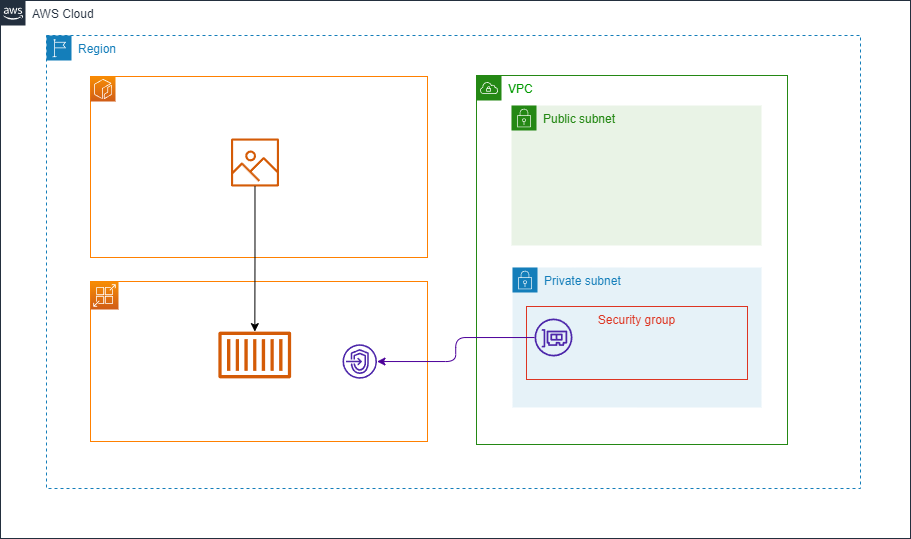

利用したサービスは下記になります。
- App Runner
- VPC
- VPC Endpoints
- ECR


簡単に利用するサービスについて説明しようと思います。

### VPC
クラウド上で、プライベートなネットワーク環境を作ることができるサービスです。  

VPCには、パブリックサブネットとプライベートサブネットと呼ばれるものがあります。  
パブリックサブネットは、インターネットと通信できる仮想ネットワーク。  
プライベートサブネットは、インターネットと通信できない仮想ネットワークと思ってもらえれば今は大丈夫です。

本来、プライベートサブネットだけで十分ですが、今回は検証でEC2を配置するためにパブリックサブネットを配置しています。

### VPC Endpoints
VPCエンドポイントは、VPC内からAWSサービスへのプライベートな接続を提供するサービスです。  
これは、VPC内のリソース（今回だとApp Runner）とプライベートサブネット間での通信を可能にします。  
これにより、Webアプリをインターネット公開せずVPC内でのみ公開することができます。

VPCエンドポイントは、インターネットを経由せずにAWSサービスに直接接続するための「窓口」のような役割を持ちます。

今回、VPC内でのみ公開することが条件となっているため必要となります。

### ECR
ECRは、コンテナイメージを保管するリポジトリです。  
身近なものだと、GitHubやGitLabなどコードを保管するSaaSのサービスがありますが、  
あれに近いものと思ってもらえればいいかなと思います。  
(DockerHubがわかるなら、それのAWS版と思ってもらえれば。。。)  

リポジトリはパブリックなものとプライベートなものとあり、  
社内で公開することが条件となっているため、プライベートなものを選択します。

今回、Webアプリのコンテナイメージの保管、そしてコンテナイメージを利用し、  
App RunnerでWebアプリをデプロイするために利用します。

App Runnerにはデプロイ方法にソースコードとコンテナイメージの2種類ありましたが、  
なぜコンテナイメージをとったのかは後ほど説明します。

### App Runner
今回の主役である、App Runnerです。  
コンテナイメージまたはソースコードからWebアプリを簡単に公開でき、
インフラの管理不要のサービスです。

今回のデプロイ方法は、ソースコードではなくコンテナイメージを選択しました。  
ソースコードを選択しなかった理由ですが、これにはGitHubやGitLabなど、  
インターネットに公開されているSaaSのサービスとApp Runnerをホスティングする必要があります。

社内でやる以上、そのようなSaaSのサービスは使用できないため、  
今回はコンテナイメージによるデプロイ方法を選択しました。

コンテナイメージによるデプロイであれば、先ほど挙げたSaaSのサービスを利用せずとも、App Runnerを利用することができます！

## App Runnerハンズオン

今回は、[FastAPI](https://fastapi.tiangolo.com/ja/)というPythonのバックエンド特化のフレームワークをデプロイしようと思います。以下のようなレスポンスが返ってくれば成功です！  
(下記の画像は、ローカル環境で動かしています。)

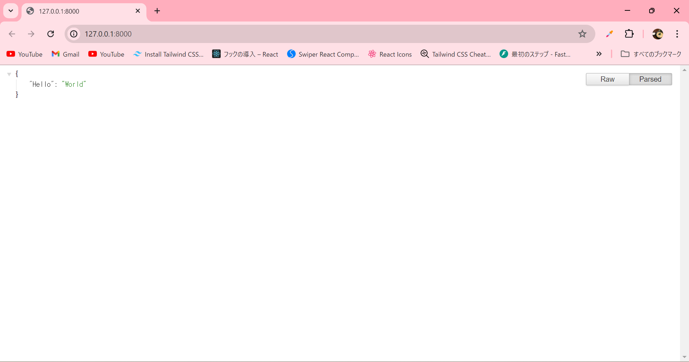


では早速、App Runnerを構築してみようと思います！今回はVPCとECRの設定については省略します。VPCエンドポイントからApp Runnerまでの一連の設定の流れを図付きで紹介させていただきます。

初期は下記のような状態になっています。

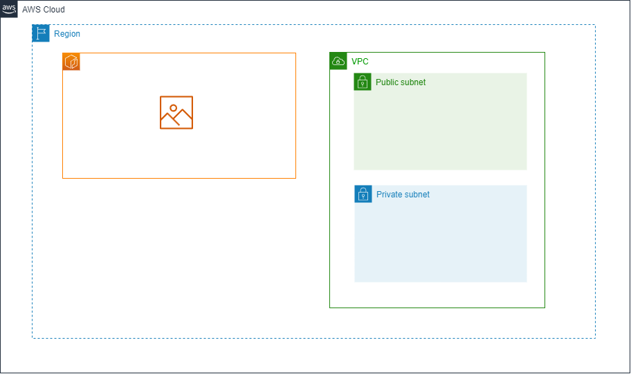

### VPCエンドポイントの作成
まず、プライベートなVPC環境とApp Runnerのサービスをパブリックなインターネットを介さず通信できるようにするために、VPCエンドポイントを作成します。  
VPCエンドポイントは、AWSコンソールでVPCの画面を開いていただき、左ペインの「エンドポイント」と書かれたところから作成できます。「エンドポイント」の画面に遷移していただくと、下記画面が表示され、右上に「エンドポイントを作成」と書かれたボタンがあります。これをクリックしましょう。  

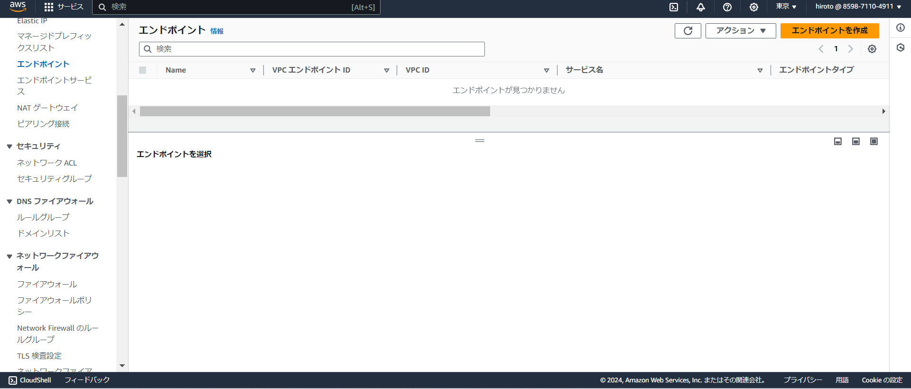


クリック後、下記画像のようなVPCエンドポイント作成のための画面が開かれます。ここで設定をしていきます。

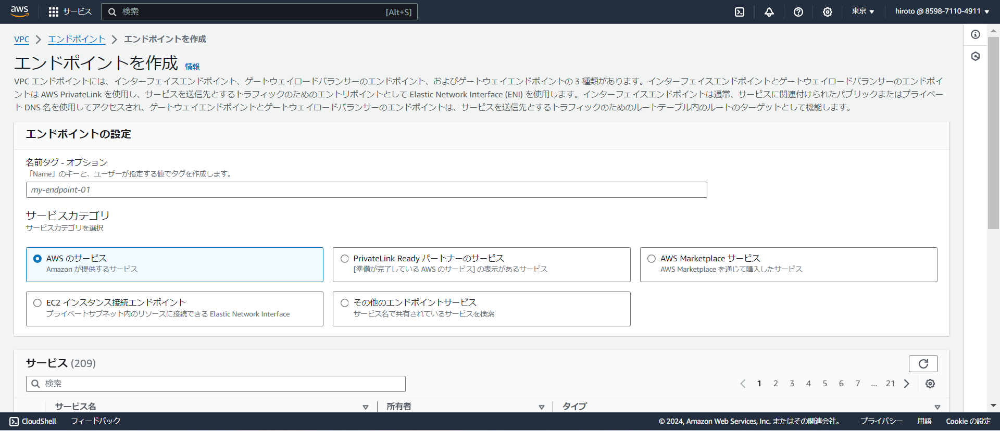

設定は下記のようにしました。
- 名前タグ：for-app-runner
- サービスカテゴリ：AWSのサービス
- サービス：com.amazonaws.ap-northeast-1.apprunner.requests
- VPC：事前作成済みのVPC
- AZ：ap-northeast-1a
- サブネット：プライベートサブネット
- IPアドレスの指定：なし
- IPアドレスタイプ：IPv4
- セキュリティグループ：app runnenr用に事前作成したセキュリティグループ

ちなみにここで選択したセキュリティグループの設定は下記のようにしています。  
HTTPSで通信するため、インバウンドルールは443のポートを空け、アウトバウンドルールはデフォルトのままにしています。(下記の画像を参考)

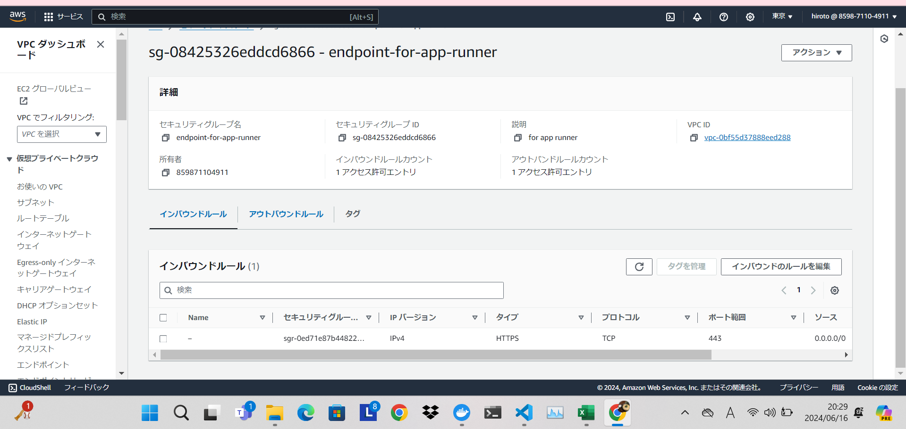
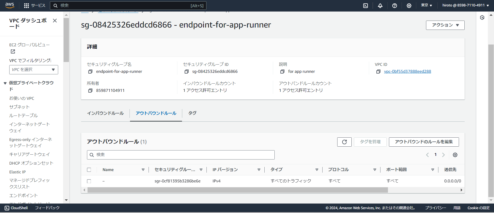

ボタンをクリック後、問題なければ下記の画像のように「VPCエンドポイントが正常に作成されました」と表示されます。  

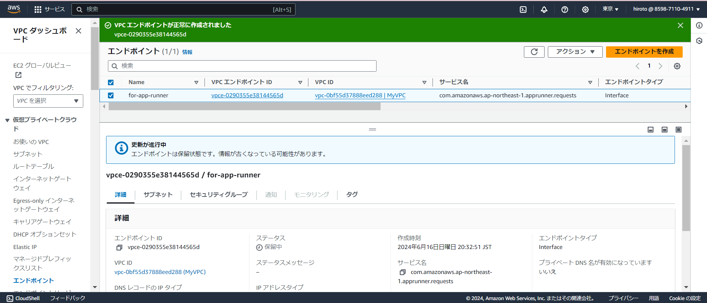

現在は下記のような構成になっています。これまでの設定で、VPCとApp Runner間が通信できるようになったので、これからApp Runnerを使って、Webアプリをデプロイしてみたいと思います。


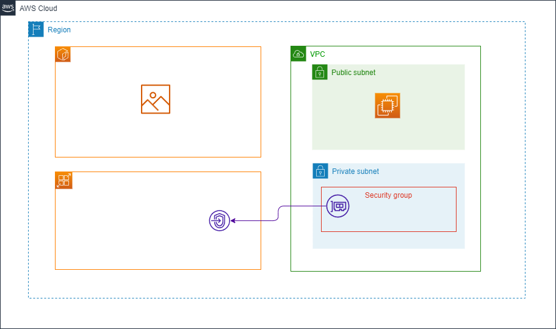

### App Runnerの作成
では、今回の主役であるApp Runnerを作成していこうと思います。   
まずは、AWSコンソールからApp Runnerの画面まで移動しましょう。移動すると下記の画面が表示されます。  

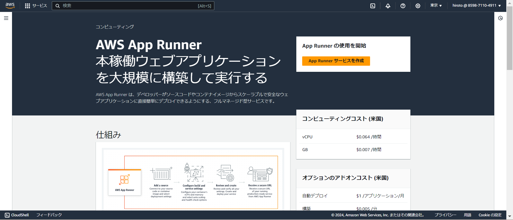

移動したら、「App Runner サービスを作成」をクリックしましょう。以下の画面に遷移します。

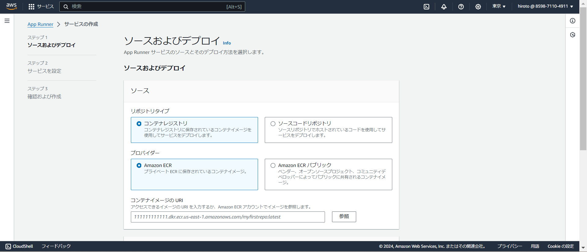

ここで、App Runnerの設定をしていきます。まずは「デプロイ方法」についてです。  
今回は、以下の内容で設定しました。

- リポジトリタイプ：コンテナレジストリ
- プロバイダー：Amazon ECR
- コンテナイメージのURL：事前作成したECRのイメージURLを選択
- デプロイ設定：自動
- ECRアクセスロール：AWS管理ポリシー([AWSAppRunnerServicePolicyForECRAccess](https://docs.aws.amazon.com/ja_jp/aws-managed-policy/latest/reference/AWSAppRunnerServicePolicyForECRAccess.html))

ここでデプロイ設定を自動にしておくと、ECRの変更を自動検知し、自動デプロイしてくれるようになります。(今回は、試してませんが後から各設定は変更できるみたいです。)

問題なければ、「次へ」をクリックしましょう。次は、サービスに関する設定です。
今回は、「サービス設定」・「ヘルスチェック」・「ネットワーキング」のみを設定しました。  
他はデフォルトの内容で設定しています。

#### サービス設定
- サービス名：my-streamlit
- ポート：8501

他は、デフォルト設定

(FastAPIと言いながら、名前やポート番号がstreamlitなのは無視してください。後ほど、訳を説明します。。。)

####  ヘルスチェック
- プロトコル：HTTP
- パス：/healthz

他は、デフォルト設定

### ネットワーキング
- 受信ネットワークトラフィック：プライベートエンドポイント
- VPC インターフェイスエンドポイントの選択：先ほど作成したVPCエンドポイントを選択
- 送信ネットワークトラフィック：カスタム VPC

ちなみにカスタムVPCは以下の内容で設定しました。  

- VPC：今回作成したVPC
- サブネット：プライベートサブネット
- セキュリティグループ：VPCエンドポイントを作成した際と同じセキュリティグループ
(インバウンドルールはHTTPS/443のポートを解放、アウトバウンドルールはデフォルト)

ここまで、設定が完了したら、「次へ」をクリックし、設定内容を確認後、問題なければデプロイしてみましょう！以下のような画面が表示されます。

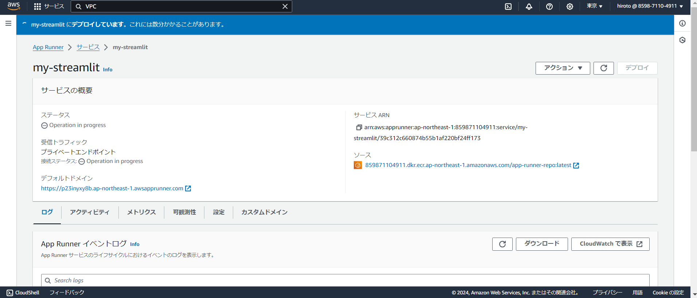

しばらく待つと以下のように「正常にデプロイされました」と通知されます。

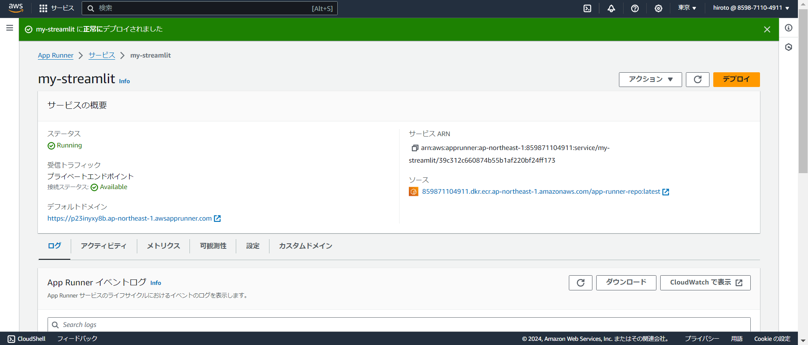

これで、下記のような構成が完成しました！


## 検証

デプロイしたものが本当に動いているか、またインターネットからアクセスできず、
VPC内からのみアクセスできることを確認してみます。  
デフォルトドメインに記載されているURLがWebアプリのURLになります。

まずは、インターネットからアクセスしてみようと思います。  
インターネットからアクセスすると下記のような結果になりました。
インターネットからのアクセスは拒否している為、もちろんWebアプリへのアクセスはできませんね！

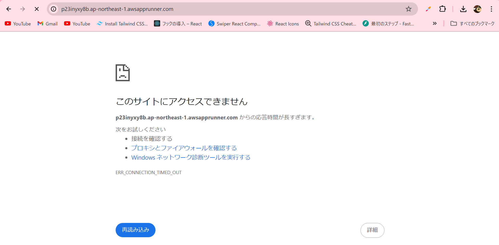

次にVPC内からアクセスしてみようと思います。今回は、VPC内にEC2(Windowsサーバ)を設置し、そこからアクセスできるか検証しました。VPC内からアクセスすると下記のような結果になりました。同じURLですが、VPC内からのアクセスのため、問題なくレスポンスが返ってきてますね！いい感じです！

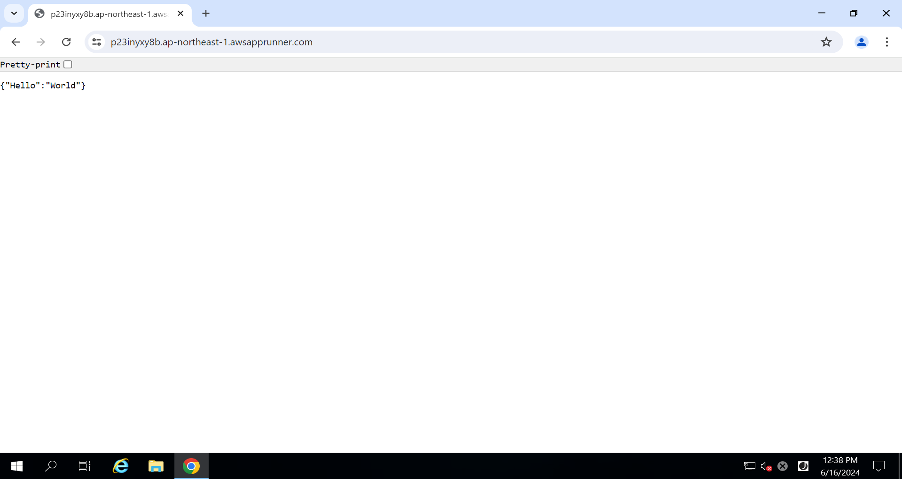

せっかくなので、自動デプロイも検証してみました。現在、下記のメッセージがレスポンスとして返ってきています。

```json
{"Hello":"World"}
```

下記のようなメッセージが返ってくるように変更したいと思います。

```json
{"Hello":"ようこそ、AWSチームへ！"}
```

Dockerファイルからコンテナイメージをビルド後、ECRにコンテナイメージをpushしてみます。  
push後、下記のようにApp Runnerが自動更新されます。


更新が完了すると、「正常にデプロイされました」と通知されます。  
再度、VPC内からアクセスしてみます。結果は下記のようになりました。問題なく更新されていますね！  

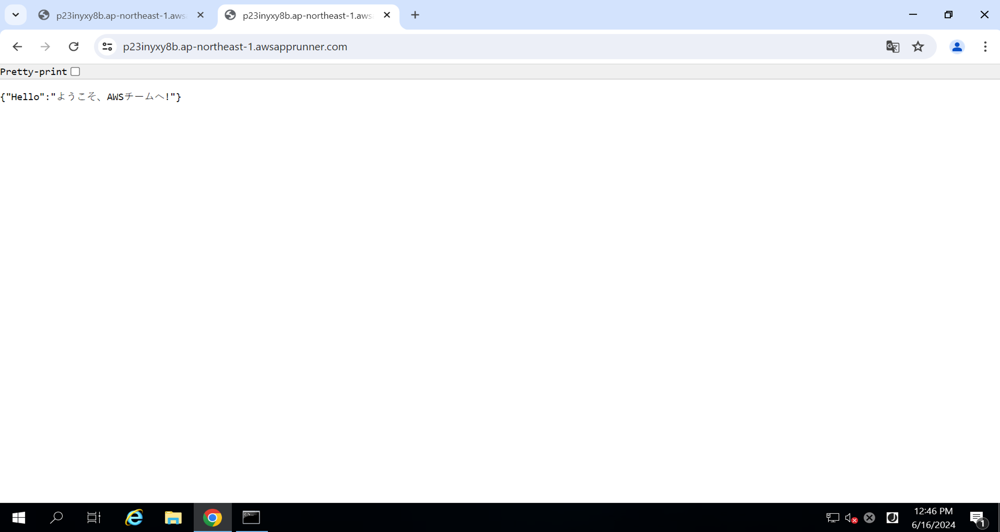


## 感想
AWSは、色々なサービスを組み合わせることで、やっと1つのシステムを構築することができます。今までWebアプリをデプロイするために触れたサービスはどれも、色んなサービスを把握して、構築するたびに何度もトラブルに当たっていました。しかし、App Runnerに関しては、把握するサービスの数も少なく、ボタンぽちぽちで簡単にデプロイまでできたので、すごく便利なサービスだと思いました。また、ECRの変更を検知し、自動デプロイまで行ってくれるため、アプリエンジニアの方にとっては素晴らしいサービスだと思いました。

## おまけ
途中の設定項目で、「my-streamlit」やポート番号がstreamlitのデフォルトポート番号である8501になっていた理由について記載します。  
もともと、FastAPIではなくStreamlitをApp Runnerを使って動かそうと考えていました。  

問題なくデプロイはでき、VPCからのみアクセスもできたのですが、ここで問題が生じました。永遠に「ロード中」なのです！

AWSの設定がおかしいのか、コードがおかしいのか色々いじっていたのですが、結論からいうとApp Runnerがwebsocketの通信に対応していないせいで永遠にロード中になっていたようです。。。(私の設定ミスではなかったみたいです。。。)
下記サイトにもissueとして挙がっていました。ちなみにAWS Summitに行った際に、AWSサポートに確認しましたがwebsocketには対応していないとの回答も頂きました。

- https://discuss.streamlit.io/t/new-deployment-option-aws-app-runner/13084/8
- https://stackoverflow.com/questions/70414143/does-aws-app-runner-properly-support-websocket-connections

正直、ここはできてほしかったと思いつつも、すべてに対応するのは現実難しいのかなと思ったりしてます。  
今後、AWSが対応してくれることを祈ります（笑）

今回は以上！

## 参考
- [[アップデート] AWS App RunnerでVPC内からのプライベートアクセスが可能になりました](https://dev.classmethod.jp/articles/aws-app-runner-supports-privately-accessible-services-amazon-vpc/)
- [詳解: AWS App Runner プライベートサービス](https://aws.amazon.com/jp/blogs/news/deep-dive-on-aws-app-runner-private-services/)